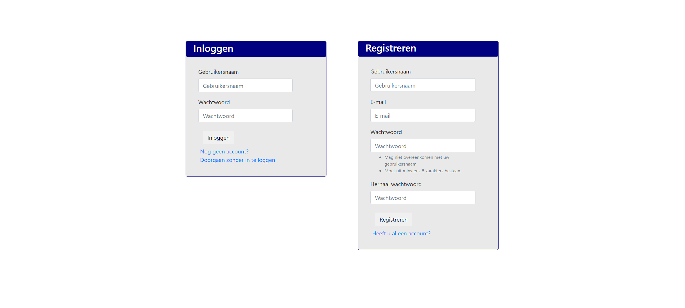
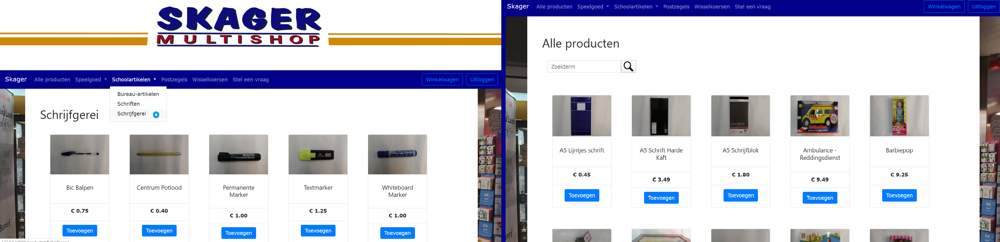
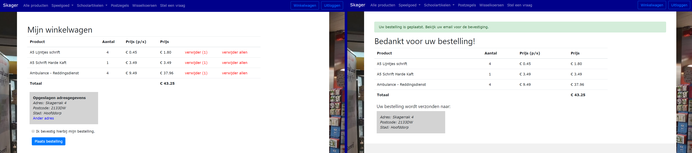
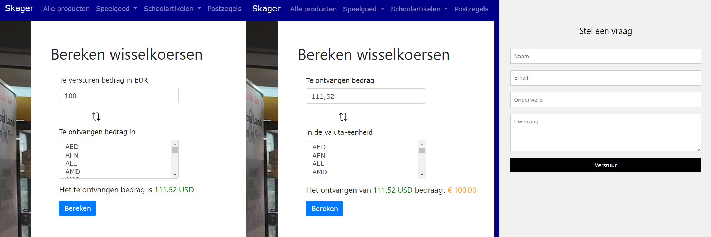

# Final Project

##### www.skagermultishop.nl
##### By Pranto Bishas

#### URL's:  
- login/  -> login screen for user  
- logout/ -> logout user  
- register/   -> register new user  

- home/  -> render homepage  
- allproducts/-> retrieve all products  
- product/<str:category>  -> retrieve product filtered by specific category  

- add_product/<str:product>/<str:price>   -> add products to user shoppingcart  
- remove_product/<str:product>/<str:price>-> remove products from user shoppingcart  
- shoppingcart/   -> see all items in shoppingcart  
- place_orders/   -> place all orders in shoppingcart

- money/  -> calculate exchange from EUR to foreign currency  
- money2/ -> calculate exchange from foreign currency to EUR  
- ask_question/   -> user can leave a message or question. The admin is able to see and respond to it.  

#### Models:
_Model to store all the products_  
def Product(Model):  
&nbsp;&nbsp;&nbsp;&nbsp;&nbsp;&nbsp;category = Charfield(choices=CATEGORIES)  
&nbsp;&nbsp;&nbsp;&nbsp;&nbsp;&nbsp;image = Imagefield()  
&nbsp;&nbsp;&nbsp;&nbsp;&nbsp;&nbsp;name = Charfield()  
&nbsp;&nbsp;&nbsp;&nbsp;&nbsp;&nbsp;description = Textfield()  
&nbsp;&nbsp;&nbsp;&nbsp;&nbsp;&nbsp;price = Decimalfield()  

_Model of all added orders to shoppingcart_  
def Shoppingcart(Model):  
&nbsp;&nbsp;&nbsp;&nbsp;&nbsp;&nbsp;user = ForeignKey(User,on_delete=CASCADE)  
&nbsp;&nbsp;&nbsp;&nbsp;&nbsp;&nbsp;category_product = Charfield()  
&nbsp;&nbsp;&nbsp;&nbsp;&nbsp;&nbsp;name_product = Charfield()  
&nbsp;&nbsp;&nbsp;&nbsp;&nbsp;&nbsp;amount_added = Integerfield()  
&nbsp;&nbsp;&nbsp;&nbsp;&nbsp;&nbsp;price_for_one = DecimalField()  
&nbsp;&nbsp;&nbsp;&nbsp;&nbsp;&nbsp;price_for_all = DecimalField()  

_Model of all placed orders_  
def MyOrders(Model):  
&nbsp;&nbsp;&nbsp;&nbsp;&nbsp;&nbsp;user = ForeignKey(User,on_delete=CASCADE)  
&nbsp;&nbsp;&nbsp;&nbsp;&nbsp;&nbsp;order = ManyToManyField(AllOrders)  

_Model to store the address of each user_  
def Address(Model):  
&nbsp;&nbsp;&nbsp;&nbsp;&nbsp;&nbsp;user = ForeignKey(User,on_delete=CASCADE)  
&nbsp;&nbsp;&nbsp;&nbsp;&nbsp;&nbsp;street = Charfield()  
&nbsp;&nbsp;&nbsp;&nbsp;&nbsp;&nbsp;number = Charfield()  
&nbsp;&nbsp;&nbsp;&nbsp;&nbsp;&nbsp;zipcode = Charfield()  
&nbsp;&nbsp;&nbsp;&nbsp;&nbsp;&nbsp;city = Charfield()  

#### API's:
- Foreign exchange API to calculate currencies for sending money
    - API access key: 5994822a63a502c5b6ad2597e876744a
    - http://data.fixer.io/api/latest?access_key=5994822a63a502c5b6ad2597e876744a

#### Extra:
- The login is not required if the user is only looking for information about the shop.
- Searchbar should retrieve products with a part of its name.
- Users are saved in the django database after registration.
