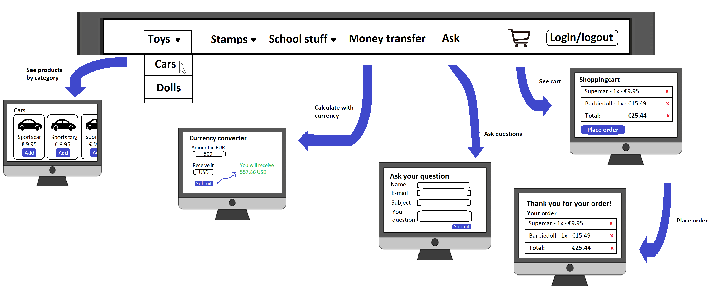
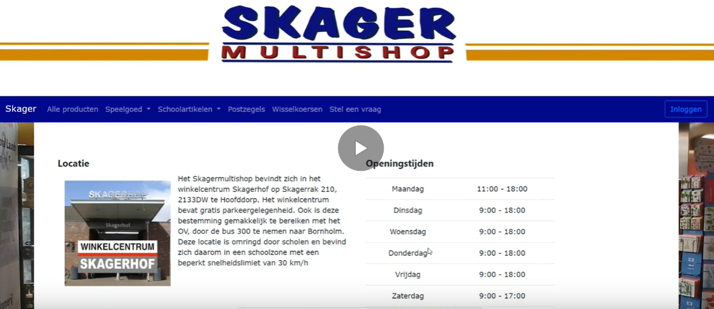

# Final Project

##### www.skagermultishop.nl
##### By Pranto Bishas
My parents have a store called *Skagermultishop*, but don't have a website.. yet!

I would like to make a website/webshop for them and the many costumers who have to visit the store to ask their questions.

These websites are normally just **informative**, but I would also like to add some other features:

* An organized navigationbar to **search and retrieve all the products** in the store (MVP)
* A **form** or **messagesystem** for costumers and businesses to leave a question or message (MVP)
* Make a **webshop** , where the user is able to login to their account (MVP)
* A **Currency calculator** for money transfer via a *API's* (OPTIONAL)

### Prerequisites

**Data-sources**:
- List of all the products and prizes of the shop
- Foreign exchange API to calculate with currency

**External components**:
- Django contains the libaries that will be needed

**Similar websites**:
- Websites like *bol.com* or *blokker.nl*: 
    - Use many subclasses to organize and filter their products.
    - Use alot of script to retrieve data from their databases, similar to django.

**Hardest part**:
- Organize the many (different) products
- Adding products to a cart, which updates automatically
- Use of API's
- Making a message-system for user questions

### Screencast

### Special thanks to:
- Bootstrap for the userfriendly and visually pleasing layout and validation.
- W3schools for the layout and spacing of the footer.
- Django for the use of its web-interface and clear documentations.
- My parents for the freedom of using there store and information.
- (I will still mention those) The TA's and teachers of the minor programming for being so helpfull.